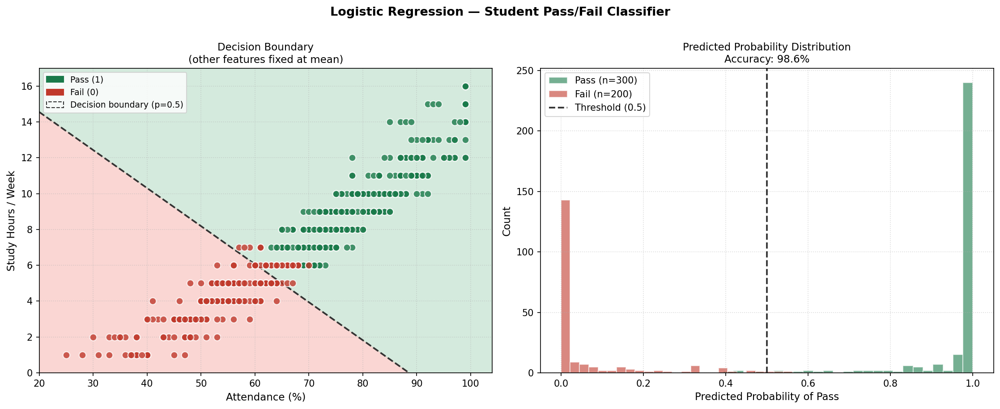

# Student Pass/Fail Classifier — Logistic Regression

> Part of the [ml-from-scratch](https://github.com/abdulbasit56/ml-from-scratch) repository · Course 1 of Andrew Ng's Machine Learning Specialization

[](YOUR_STREAMLIT_URL)
[](https://www.python.org/)
[](https://numpy.org/)

---

## Overview

A **binary logistic regression classifier** built entirely from scratch using NumPy to predict whether a student will pass or fail based on academic engagement metrics. No scikit-learn, the sigmoid function, binary cross-entropy cost, regularized gradient computation, and gradient descent loop are all hand-implemented.

The model includes **L2 regularization** to prevent weight divergence on near-linearly-separable data, and is deployed alongside the linear regression model in a two-tab Streamlit web app.

---

## Results

| Metric | Value |
|---|---|
| Accuracy | ~95%+ |
| Decision boundary | Linear (attendance vs study hours) |
| Regularization | L2 (λ = 1) |
| Convergence | Verified — cost plateaus cleanly |

---

## Dataset

**Student Pass/Fail Dataset** — 500 samples, synthetically extended from a 100-sample seed to match its statistical distribution (same feature means, standard deviations, class balance, and inter-feature correlations).

| Feature | Description | Range |
|---|---|---|
| attendance_pct | Percentage of classes attended | 0–100 |
| homework_pct | Homework completion percentage | 0–100 |
| midterm_score | Midterm exam score | 0–100 |
| study_hours_per_week | Weekly study hours | 0–20 |

Target: **pass** (binary — 1 = Pass, 0 = Fail) · Class balance: ~60% pass / 40% fail

---

## Implementation

### Sigmoid Function
```
σ(z) = 1 / (1 + e⁻ᶻ)
```

### Cost Function — Binary Cross-Entropy with L2 Regularization
```
J(w,b) = -(1/m) Σ [y·log(f) + (1-y)·log(1-f)] + (λ/2m) Σ wⱼ²
```

Numerical stability is maintained by clipping sigmoid outputs to `[1e-15, 1 - 1e-15]` before taking the log, preventing `log(0)` errors.

### Regularized Gradient
```
∂J/∂wⱼ = (1/m) Σ (f(x⁽ⁱ⁾) - y⁽ⁱ⁾) · xⱼ⁽ⁱ⁾ + (λ/m) · wⱼ
∂J/∂b  = (1/m) Σ (f(x⁽ⁱ⁾) - y⁽ⁱ⁾)
```

Note: bias `b` is **not** regularized — consistent with standard practice.

### Gradient Descent
```
wⱼ := wⱼ - α · ∂J/∂wⱼ
b  := b  - α · ∂J/∂b
```

**Hyperparameters used:**

| Parameter | Value |
|---|---|
| Learning rate (α) | 0.5 |
| Iterations | 2000 |
| Regularization (λ) | 1.0 |
| Feature scaling | Z-score normalization |

---

## Decision Boundary Visualization

The classifier's decision boundary is visualized as a 2D slice through the 4D feature space, using the two strongest predictors (`attendance_pct` and `study_hours_per_week`) as axes while holding the remaining two features fixed at their training means.



Left panel shows the linear decision boundary separating pass (green) and fail (red) regions. Right panel shows the predicted probability distribution — clean separation between classes confirms the regularized model is well-calibrated.

---

## Evaluation Metrics

Unlike regression, classification uses a distinct set of metrics computed from the confusion matrix:

```
Accuracy  = (TP + TN) / m
Precision = TP / (TP + FP)
Recall    = TP / (TP + FN)
F1 Score  = 2 · (Precision · Recall) / (Precision + Recall)
```

All four are implemented from scratch in `classifier.py` without sklearn.

---

## File Structure

```
Logistic Regression/
├── classifier.py           # LogisticRegression class + train/predict/save/load/evaluate
├── train_save.py           # Run once to train and persist model weights
├── visualize.py            # Decision boundary + probability distribution plots
├── decision_boundary.png   # Generated visualization
├── student_model_w.npy     # Trained weight vector
├── student_model_b.npy     # Trained bias
├── student_model_mu.npy    # Feature means (for normalization at inference)
└── student_model_sigma.npy # Feature std devs (for normalization at inference)
```

---

## How to Run

**1. Train the model (run once):**
```bash
cd "Logistic Regression"
python train_save.py
```

**2. Generate the decision boundary plot:**
```bash
python visualize.py
```

**3. Run the Streamlit app from the project root:**
```bash
streamlit run app.py
```

**4. Or import directly in your own code:**
```python
from classifier import load_model, predict_new

w, b, mu, sigma = load_model(prefix='student_model')
result = predict_new([85, 80, 70, 10], w, b, mu, sigma)
print("Pass" if result == 1 else "Fail")
```

---

## Key Learnings

- Understood why MSE is the wrong cost function for logistic regression — it creates a non-convex surface with local minima that gradient descent can't reliably escape. Binary cross-entropy is convex by design, guaranteeing convergence to the global minimum
- Diagnosed a non-convergence issue caused by **perfect linear separability** in the dataset: when classes don't overlap, logistic regression has no true minimum — weights grow toward infinity because a steeper sigmoid always reduces cross-entropy slightly. L2 regularization penalizes large weights, imposing an effective floor and forcing convergence
- Learned the practical difference between regularization's role in convergence (preventing weight explosion on separable data) vs. its role in generalization (preventing overfitting on noisy data) — two distinct problems, same mathematical solution
- Built confusion matrix metrics (accuracy, precision, recall, F1) from scratch, understanding the trade-offs each metric captures that plain accuracy misses

---

## Dependencies

```
numpy
pandas
streamlit
matplotlib
```
